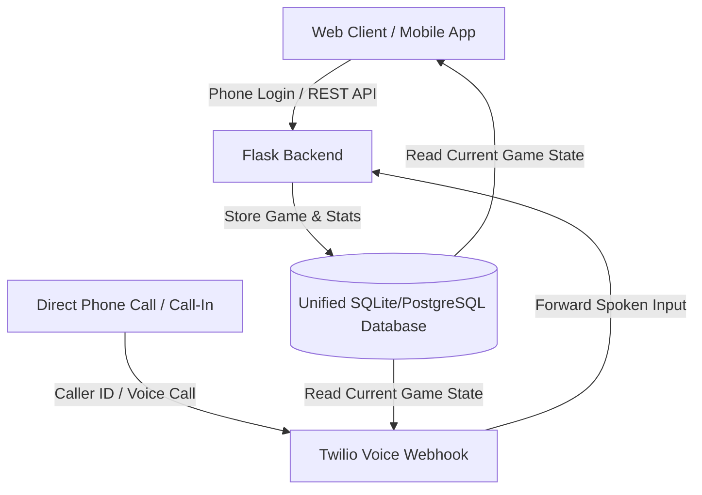

# Implementation Plan: Voice Call Play & Phone-Based Accounts

This plan outlines the architecture to add a **Voice Call Option** coupled with a **Phone-Number-Based Account System**. This unified system allows users to play chess by voice (either via WebRTC in-app calls or direct mobile telephone calls) and automatically syncs their games, analysis records, and stats to a single database using their phone number as the unique identifier.

---

## 🚀 Valuation & Acquisition Play

To maximize user traction and create a highly valuable asset for acquisition, the design focuses on **frictionless onboarding**:
- **One-Tap Phone Sign-In**: Users enter their phone number to instantly create an account. No passwords, no complicated forms.
- **Cross-Platform Sync**: A user can start a game on the website, "call" the platform from their mobile phone to make a few moves verbally while walking around, and see the board update in real time on their web screen. This is a highly investable, "wow-factor" tech demo.

---

## 🤖 Chess Engine Bot Strategy (Hybrid Approach)

To ensure the best balance between a lightweight/reliable prototype and a highly valuable acquisition pitch:
1. **Default Local Engine (Stockfish Elo-Limiting)**:
   - Play is driven by the built-in Stockfish engine, utilizing the standard UCI commands `UCI_LimitStrength = true` and `UCI_Elo = [800, 1500, 2800]` to simulate different player tiers (Coach Martin, Coach Sophia, GM Magnus).
   - This runs completely offline on standard CPUs and requires zero installation overhead.
2. **Modular UCI Design (Extensible for Maia/Lc0)**:
   - The backend engine loader is written as a generic UCI wrapper. This allows the system to easily load neural network weights (like **Maia Chess** running on **Lc0**) simply by replacing the binary file path in settings. This shows acquirers a highly scalable, future-proof AI bot pipeline.

---

## 📞 System Architecture

Both the Web Application and the Telephony (Incoming Call) interfaces talk to the **same Flask Backend** and database instance:

---

## ❓ Open Questions

Please review the following architectural considerations:
1. **SMS Gateway Verification**:
   - For the prototype, we can auto-verify any phone number input to keep onboarding 100% free and fast.
   - For production, we can toggle **Firebase Phone Auth** or **Twilio Verify** to send actual SMS passcode checks.
2. **Direct Inbound Telephony Number**:
   - Do you want us to provision a test Twilio Phone Number so you can make a real phone call from your cell phone to play chess?

---

## 🛠️ Proposed Changes

### 1. Database Schema (Backend)

#### [NEW] [models.py](file:///Users/abhisheknagaraja/Documents/chess-analyzer/models.py)
We will introduce a database model using SQLAlchemy to store:
- **Users**: `phone_number` (Primary Key), `created_at`, `accuracy_average`.
- **Games**: `id`, `user_phone`, `white_player`, `black_player`, `pgn`, `accuracy`, `created_at`.

### 2. Twilio Telephony Webhook

#### [MODIFY] [app.py](file:///Users/abhisheknagaraja/Documents/chess-analyzer/app.py)
We will add a `/api/voice` webhook endpoint to process real incoming phone calls:
1. Identify the caller using `request.form.get("From")` (Caller ID / Phone Number).
2. Fetch or create the user record in the DB.
3. Retrieve their active game state.
4. Prompt the user for a move:
   - `<Gather input="speech" action="/api/voice/process_move">`
5. Parse the spoken input (e.g. "e4"), validate it via `chess.js`, save it to the DB, and read back the engine response using text-to-speech.

### 3. Web Interface Onboarding

#### [MODIFY] [index.html](file:///Users/abhisheknagaraja/Documents/chess-analyzer/static/index.html)
- Add a clean, modern **Phone Number Login Screen** before the main dashboard (which caches the number in `localStorage` to bypass login on future visits).
- Display a **"My Saved Games"** section on the dashboard showing the user's historical games, accuracy charts, and analysis.

### 4. Client-Side in-App Calls

#### [MODIFY] [app.js](file:///Users/abhisheknagaraja/Documents/chess-analyzer/static/app.js)
- Wire up the browser Web Speech API overlay (dial screen, waveform, hangup buttons) to let users make microphone-based calls to the virtual coach directly inside the web browser.
- Sync vocal moves to the backend database using the logged-in phone number.
