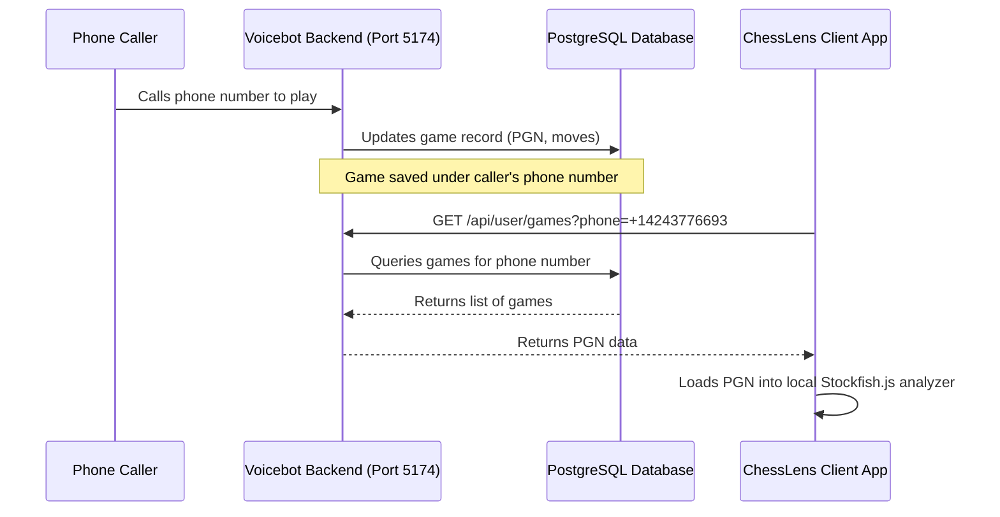

# Repository Split Analysis: ChessLens vs. Voice Chessbot

This document analyzes the technical and product requirements of the **ChessLens local analyzer** and the **Voicebot telephony service** to evaluate whether they should be split into separate repositories, and provides a proposed architectural roadmap for the split.

---

## 📋 Executive Summary
**Recommendation: Yes, split the repository.**
The current project functions as a hybrid codebase containing:
1. A client-side, local-first web/mobile chess analyzer (**ChessLens**).
2. A cloud-dependent telephony/voice bot platform (**Voice Chessbot**).

Keeping them in a single repository creates conflicts in security, deployment workflows, dependency size, and user experience. Separating them into two repositories—`chesslens-client` (Frontend & iOS App) and `chess-voice-backend` (Telephony Server)—will streamline development, keep the local client secure, and simplify backend operations.

---

## 🔍 Architecture Comparison

| Dimension | ChessLens (Local Analyzer) | Voice Chessbot (Telephony Platform) |
| :--- | :--- | :--- |
| **Primary Goal** | Free, instant local analysis using Stockfish (offline). | Voice-based chess play via incoming phone calls. |
| **Hosting Requirement**| Static Web Hosting (GitHub Pages, Netlify, Vercel) or App Store packaging. | Web Server with public HTTPS endpoints (Render, Railway, AWS). |
| **Database** | Client-side only (`localStorage`, IndexedDB). | Online relational database (PostgreSQL) for user phone accounts. |
| **Secrets/Credentials** | None (100% public code). | High-security API keys (Twilio credentials, Gemini API key). |
| **Dependencies** | Small footprint (HTML, CSS, JS, Capacitor, Stockfish.js). | Large footprint (Flask, SQLAlchemy, Twilio SDK, audio processing libraries like `pydub`, `faster-whisper`, `numpy`). |
| **Internet Status** | 100% Offline-friendly. | Required (for Webhook processing). |

---

## 🛠️ Reasons for Splitting the Repositories

### 1. Secrets Management and Security
- **The Problem**: The backend needs access to the `TWILIO_ACCOUNT_SID`, `TWILIO_API_KEY`, `TWILIO_API_SECRET`, and `GEMINI_API_KEY`. In a monolithic setup, it is easy to accidentally expose configs or pack backend environment variables into the iOS bundle.
- **The Solution**: By splitting the backend into its own repository, we ensure that API keys and webhook secrets reside strictly in the production deployment environment (e.g. Render/Railway dashboard) and are never included in the client-side binary.

### 2. Dependency Bloat and Build Performance
- **The Problem**: The Python dependencies required for audio/whisper processing (`faster-whisper`, `numpy`, `pydub`, `psycopg2`) compile heavy binary wheels. A frontend developer or mobile tester does not need to install these tools or set up databases just to preview UI tweaks.
- **The Solution**:
  - The client repository requires only `npm install` for Capacitor wrappers and Stockfish.js.
  - The backend repository maintains its own virtual environment and Dockerfiles for heavy voicebot processing.

### 3. Deployments and Platform Constraints
- **ChessLens Client**: Designed to run inside standard browser threads or iOS WebViews. It compiles into static HTML/JS assets. Deploys are instant and cost zero dollars on static hosts.
- **Voicebot Backend**: Requires a persistent container to listen to Twilio webhook traffic, spin up engine instances, and talk to database servers. This requires managed container hosting (Docker).

---

## 🗺️ Proposed Target Architecture

### Repository 1: `chesslens-client` (Frontend & iOS App)
A lightweight repository containing all user interface assets.
- **Directory Structure**:
  ```text
  chesslens-client/
  ├── static/                # Web app assets (index.html, app.js, style.css)
  │   ├── js/
  │   │   └── stockfish.js   # Stockfish WebAssembly worker
  │   └── assets/            # Chess textures and sounds
  ├── ios/                   # Capacitor-generated iOS Xcode project
  ├── package.json           # Capacitor CLI dependencies (no Python required)
  └── capacitor.config.json
  ```
- **How Engine Runs**: Runs strictly client-side via a browser Web Worker pointing to `stockfish.js` WebAssembly.
- **How Sync Works**: If a user wants to view their game history, the frontend calls a public API on the voicebot backend using the user's verified phone number.

### Repository 2: `chess-voice-backend` (Telephony Engine & API Server)
A Python repository containing the voice processing pipeline and game databases.
- **Directory Structure**:
  ```text
  chess-voice-backend/
  ├── app.py                 # Flask server, Twilio Webhook handlers
  ├── models.py              # PostgreSQL schema (Users, Games)
  ├── requirements.txt       # Python dependencies (twilio, sqlalchemy, faster-whisper)
  ├── Dockerfile             # Container configuration (installs ffmpeg for pydub)
  └── engines/
      └── stockfish_binary   # Compiled native Stockfish binary for server limits
  ```
- **How Engine Runs**: Runs a native Stockfish binary on the host server, configuring CPU threads and limiting Elo rating based on the selected opponent difficulty.

---

## 🔌 Synchronization Bridge (API Contract)

To maintain a unified experience (where games played on the phone can be reviewed inside the ChessLens client app), the two repositories will communicate over a simple REST API:



### Required Sync Endpoints:
1. **`GET /api/user/games`**: Returns all completed/active games matching the user's phone number.
2. **`POST /api/games/sync`**: Allows the client to upload game data (like external Chess.com reviews) to sync with their account history.
